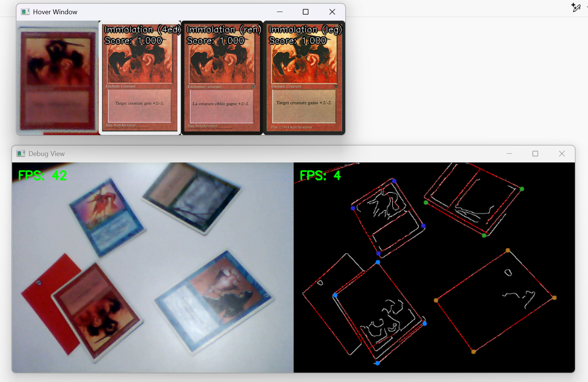

### Card detection using openCV and pytorch

Toy project for getting familiarized with openCV and utilizing pytorch models in cpp.

The program tries to detect and identify cards from a camera stream.



### Usage
To set up the database you need to run
```
python make_database.py
```

if you want to download the images from scryfall, you need to set the 
`DOWNLOAD_IMAGES_FROM_SCRYFALL` variable to `True`

You can also change the sets you want to include by changing the `sets`. I trained on english sets (images defaulted as the ones without the missing language banner) until homelands, this is also the onnx file that is included.


### Card detection
The idea here is that I use a probabilistic Hough Transform to get the line lements of the image.
We then do a DFS on the lines to find cycles of minimum cost.

The cost is ~ the proportional length needed to 
 - Join 'paralell' lines
 - Extend lines to their crossing point, making a corner. 


### Card matching
The unwarped card is matched to a dictionarly of feature vectors via a CNN, and the match ranking is based on the Consine Similarity between the detected image and the database of cards.

### CNN model
The card matching is done by similarity comparison using a pre-trained encoder trained with PyTorch. We leverages the pre-trained models of torchvision and fine-tune them on the custom MTG database. Specifically, we train an auto-encoder using iomage augmentation to maxmimise the cosine similarity between modified images and the oracle input.


